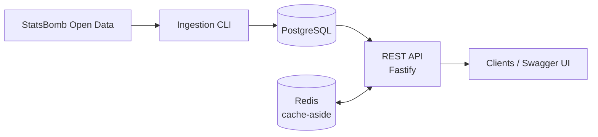

# SportsPulse

Cloud-native football analytics platform: a REST API (TypeScript + Fastify) over PostgreSQL with a
Redis cache-aside layer, fed by an idempotent ingestion pipeline. Built as an engineering portfolio
project, with reliability, security and operability treated as first-class features. Target platform:
**Azure** (Container Apps, PostgreSQL Flexible Server, Cache for Redis, Key Vault, Application
Insights) provisioned with Terraform and deployed through GitHub Actions.

> **Status:** MVP in progress. Local development, ingestion, the read API and caching work end to
> end. Cloud deployment, auth and observability are on the roadmap below.

## What works today

- **Read API** (`/api/v1`): competitions, seasons, teams and matches with pagination, filtering, sorting,
  consistent errors and request IDs.
- **Redis cache-aside**: list/detail responses are cached with TTL; a Redis outage degrades to
  PostgreSQL-only reads instead of breaking the API (see [ADR-003](docs/adr/ADR-003-redis-cache-aside.md)).
- **Interactive docs**: OpenAPI 3 generated from the same Zod schemas that validate requests (`/docs`).
- **Ingestion** from StatsBomb Open Data: retries with exponential backoff + jitter, per-record validation,
  transactional and idempotent writes, run tracking (`ingestion_runs`).
- **Health probes**: `/health/live` and `/health/ready` (reports Redis status without depending on it).
- **Quality gates**: strict TypeScript, ESLint with architecture boundaries, unit tests, `npm audit`,
  Docker build in CI.

## Tech stack

| Area | Choice |
|---|---|
| Runtime / language | Node.js 22, TypeScript (strict) |
| HTTP | Fastify 5, `@fastify/swagger` |
| Validation & contracts | Zod (single source of truth for validation, types and OpenAPI) |
| Database | PostgreSQL 16 via `pg` (parameterized queries only) |
| Cache | Redis via `ioredis`, cache-aside pattern |
| Tests | Vitest |
| Containers | Docker (multi-stage, non-root), Docker Compose for local dev |
| CI | GitHub Actions |
| Planned | Terraform, Azure, k6, CodeQL / Trivy / Dependabot, Application Insights |

## Architecture

A modular monolith: business modules under `src/modules`, cross-cutting code under `src/shared`,
boundaries enforced by ESLint. Details in [docs/architecture.md](docs/architecture.md) and the
[ADRs](docs/adr).



## Project structure

```
src/
  modules/
    catalog/      read API: routes -> service (cache-aside) -> repository, Zod schemas
    ingestion/    HTTP client, validation, repository, service, CLI, sources/statsbomb
    health/       liveness and readiness probes
  shared/
    config/       environment validation
    database/     pool, migrations runner, query helpers
    cache/        Redis wrapper (never throws), cache-aside helper
    http/         errors, pagination, Zod <-> Fastify adapter
  app.ts          app factory (composition)
  server.ts       process entry point
db/migrations/    versioned SQL
docs/             architecture, database, api, data management, caching, ADRs
tests/            unit tests (integration / e2e / performance planned)
infra/terraform/  infrastructure as code (planned)
```

## Getting started

Requirements: Node.js 22+, Docker.

```bash
cp .env.example .env     # set DATABASE_*; DATABASE_HOST=127.0.0.1, REDIS_HOST=127.0.0.1
docker compose up -d     # PostgreSQL + Redis
npm install
npm run migrate          # apply db/migrations
npm run ingest           # load FIFA World Cup 2018 (competition 43, season 3)
npm run dev               # http://localhost:3000
```

Useful commands: `npm test`, `npm run lint`, `npm run typecheck`, `npm run ingest -- --list`
(browse the StatsBomb catalog), `npm run ingest -- --competition <id> --season <id>`.

Set `REDIS_ENABLED=false` to run without Redis (the API falls back to PostgreSQL-only reads, same
code path as a live Redis outage). If port 5432 or 6379 is unavailable locally, change
`DATABASE_PORT` / Redis's compose mapping.

## API

Interactive documentation at **`/docs`** (spec at `/docs/json`). Full conventions in [docs/api.md](docs/api.md).

| Method | Path | Description |
|---|---|---|
| GET | `/api/v1/competitions` | List competitions (`q`, `country`, `sort`) |
| GET | `/api/v1/seasons` | List seasons (`competitionId`, `sort`) |
| GET | `/api/v1/teams` | List teams (`q`, `country`, `sort`) |
| GET | `/api/v1/teams/:id` | Team detail |
| GET | `/api/v1/matches` | List matches (`seasonId`, `teamId`, `status`, `from`, `to`, `sort`) |
| GET | `/api/v1/matches/:id` | Match detail |
| GET | `/health/live`, `/health/ready` | Probes |

All list endpoints accept `page` and `pageSize` (max 100). All are cached (see
[docs/caching.md](docs/caching.md)).

## Data and attribution

Data comes from [StatsBomb Open Data](https://github.com/statsbomb/open-data). **If you publish work based
on it, credit StatsBomb as the source and follow their user agreement** (which asks for their logo).
No personal data is stored. See [docs/data-management.md](docs/data-management.md).

## Security

Implemented: validated configuration (no secrets in Git), Zod validation on every input, parameterized SQL
with whitelisted sort columns, LIKE-wildcard escaping, fixed allow-listed ingestion URLs (SSRF-safe), request
size limit, uniform errors that never leak internals, non-root container, dependency audit in CI.
Planned: authentication/RBAC for admin endpoints, rate limiting, Key Vault + Managed Identity, least-privilege
database roles, CodeQL / Trivy, threat model. Reporting policy in [SECURITY.md](SECURITY.md).

## Roadmap

- [x] Project scaffold, schema, Docker, CI
- [x] Idempotent ingestion (StatsBomb)
- [x] Modular structure with enforced boundaries
- [x] Read API + OpenAPI
- [x] Redis cache-aside with graceful degradation
- [ ] Auth, RBAC and admin ingestion endpoint; rate limiting
- [ ] Terraform + Azure deployment; Key Vault / Managed Identity
- [ ] Full CI/CD (CodeQL, Trivy, staged deploys)
- [ ] Observability (structured logs, metrics, Application Insights)
- [ ] Performance (k6, EXPLAIN ANALYZE) and failure testing

## Workflow

Feature branches, Conventional Commits, pull requests with green CI, architecture decisions recorded in
[docs/adr](docs/adr).
