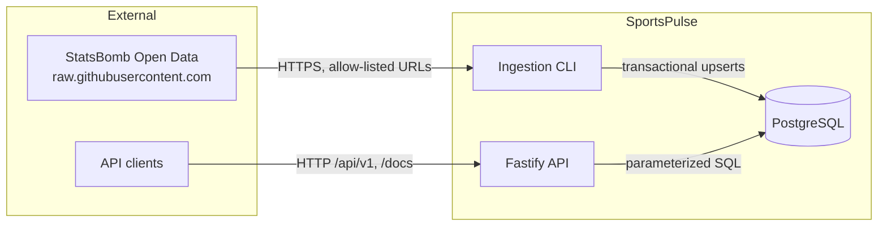

# Architecture

## Current system



## Code organization

Modular monolith (see [ADR-001](adr/ADR-001-modular-monolith.md)).

```
src/modules/<module>/   routes -> service -> repository (dependencies point downward)
src/shared/             config, database helpers, http helpers
```

Rules enforced by ESLint (`no-restricted-imports`):
- `shared/` never imports from `modules/`.
- A module never imports from another module; `app.ts` composes them.

| Layer | Responsibility |
|---|---|
| routes / CLI | Input adapters: declare schemas, call the service |
| service | Use cases and business rules (e.g. "team not found" -> 404) |
| repository | SQL only; parameterized; returns DTO-shaped data |

## Request flow (read API)

1. Fastify assigns a request id (`x-request-id` is accepted if valid, else generated).
2. The Zod validator parses `params` / `querystring`; failures become `400 VALIDATION_ERROR`.
3. The service calls the repository, which runs a data query and a count query in parallel.
4. The response is serialized **through the response schema**, so only declared fields leave the API.
5. Errors go through one handler: `{ error: { code, message, requestId, details? } }`; 5xx never leaks internals.

## Ingestion flow

```mermaid
sequenceDiagram
  participant CLI
  participant Svc as ingestion service
  participant SB as StatsBomb
  participant DB as PostgreSQL
  CLI->>Svc: ingest(competition, season)
  Svc->>DB: start run (idempotency key)
  alt already COMPLETED
    Svc-->>CLI: skipped
  else
    Svc->>SB: GET competitions.json (retry/backoff)
    Svc->>SB: GET matches/{c}/{s}.json
    Svc->>Svc: validate each record (Zod)
    Svc->>DB: BEGIN; upserts; COMMIT
    Svc->>DB: finish run (COMPLETED / PARTIAL / FAILED)
  end
```

## Trust boundaries (initial view)

| Boundary | Threats considered | Controls in place |
|---|---|---|
| Internet -> API | Malformed input, SQL injection, oversized bodies | Zod validation, parameterized SQL, whitelisted sort, 1 MiB body limit |
| Ingestion -> external source | SSRF, malicious/invalid payloads | Fixed base URL + validated integer ids, per-record validation, timeouts |
| API -> PostgreSQL | Over-privileged access | Connection/statement timeouts (least-privilege roles planned) |

A full STRIDE threat model will live in `docs/threat-model.md`.

## Target architecture (planned)

Azure Container Apps (API + ingestion job), Azure Database for PostgreSQL Flexible Server, Azure Cache for
Redis, Blob Storage for raw payloads, Key Vault + Managed Identity for secrets, Application Insights for
telemetry; Terraform for provisioning and GitHub Actions for delivery.
