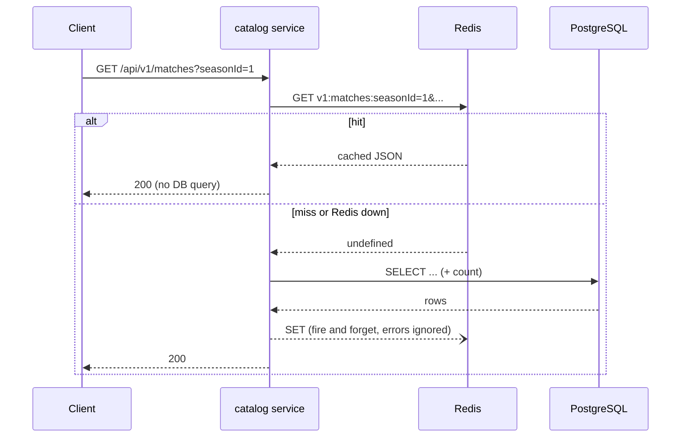

# Caching

Pattern: **cache-aside**, implemented once in `src/shared/cache/cache-aside.ts` and used by every
read operation in `src/modules/catalog/service.ts`. Full rationale in
[ADR-003](adr/ADR-003-redis-cache-aside.md).

## How a request flows

## Keys and TTL

- Key: `v1:<resource>:<param>=<value>&...`, params alphabetically sorted so that the same filters in
  any order hit the same entry. Built by `cacheKey()`.
- TTL: `CACHE_TTL_LIST_SECONDS` (default 60s) for list endpoints, `CACHE_TTL_DETAIL_SECONDS` (default
  120s) for single-resource endpoints. No explicit invalidation yet; see ADR-003 for the trade-off.

## Graceful degradation

If Redis is slow, down, or `REDIS_ENABLED=false`, the API keeps working from PostgreSQL alone:

1. `wrapRedis()` catches every Redis call; a failure is logged and treated as a miss / no-op, never thrown.
2. The `ioredis` client has an `on('error', ...)` listener. Without it, an unhandled `error` event on a
   Node `EventEmitter` crashes the process — this is what actually makes "Redis down ≠ API down" true.
3. `/health/ready` reports `{ postgres, redis }` but only a PostgreSQL failure returns `503`.

This is verified by tests, not just asserted: `tests/unit/cache.test.ts` simulates a Redis client whose
every method rejects, and `tests/unit/catalog.test.ts` hits a real endpoint through `buildApp` with a
failing cache and checks it still returns `200` with correct data.

## Known limitations

- No active invalidation on write (ingestion does not clear affected keys); staleness is bounded by TTL only.
- No cache hit/miss metrics yet (planned for the observability phase).
- Single Redis instance; no cluster/HA configuration (fine for a portfolio project, revisit for production).
