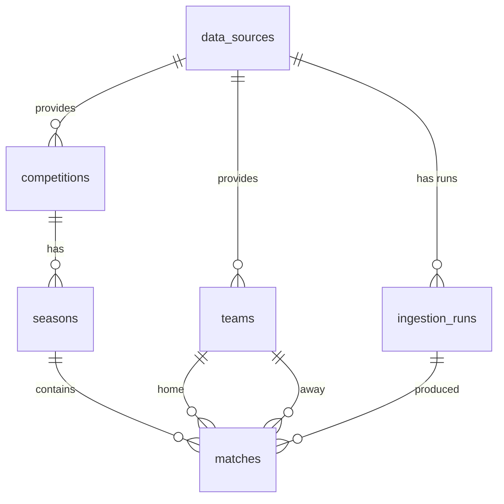

# Database

PostgreSQL 16. Schema is versioned SQL in `db/migrations`, applied in filename order by `npm run migrate`
(each file in a transaction, tracked in `schema_migrations`).

## Tables

| Table | Purpose | Notable constraints |
|---|---|---|
| `data_sources` | Origin of data | `code` unique |
| `ingestion_runs` | One row per ingestion run | `UNIQUE(source_id, idempotency_key)`; status `CHECK`; `finished_at >= started_at` |
| `competitions` | Leagues / tournaments | `UNIQUE(source_id, external_id)` |
| `seasons` | Editions of a competition | FK to competition (cascade); `end_date >= start_date` |
| `teams` | Clubs / national teams | `UNIQUE(source_id, external_id)` |
| `matches` | Fixtures and results | `home_team_id <> away_team_id`; scores `>= 0`; `UNIQUE(season_id, external_id)` |

## Design notes

- **Idempotent ingestion:** natural keys `(source_id, external_id)` + `INSERT ... ON CONFLICT DO UPDATE`.
  Re-running never duplicates rows.
- **Lineage:** `matches.ingestion_run_id` records which run produced/updated each row (INTERNAL, not exposed by the API).
- **Indexes:** `matches(season_id, kickoff_at)`, `matches(home_team_id)`, `matches(away_team_id)`,
  `seasons(competition_id)`, plus the unique indexes above.
- **Types:** ids are `bigint` identity columns; the `pg` driver is configured to return them as JS numbers
  (safe well below 2^53).
- **Dynamic queries:** values are always bound parameters; `ORDER BY` columns come from a whitelist;
  user text used in `ILIKE` has wildcards escaped.

## Planned

- Least-privilege roles: separate migration user and application user (no superuser for the app).
- `pg_trgm` GIN indexes if name search becomes a hot path (validate with `EXPLAIN ANALYZE`).
- Keyset pagination if deep pagination proves slow; players, events and statistics tables.
- Backups and a documented restore test.
